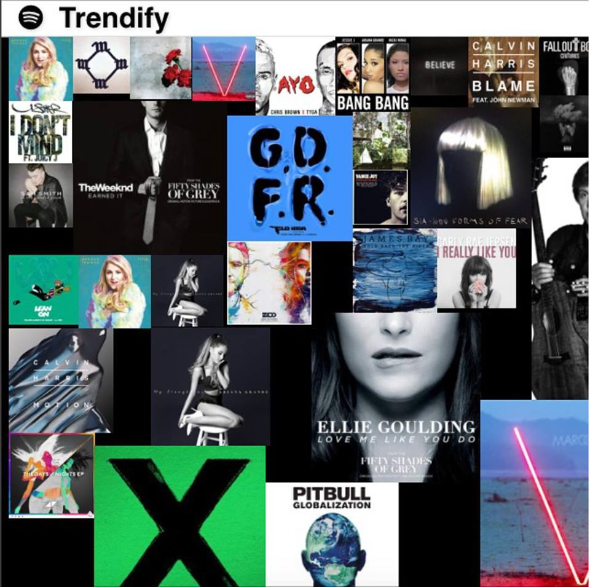

# guhTrends
visualisation of top trending songs currently on spotify, made at Great Uni Hack in spring 2015

Working in a team of 3, we had 36 hours to come up with an idea then make it!

Using python to access the spotify api, then converting the data to json - we then visualised it using some JavaScript wizardry, and a framework called [packery](http://packery.metafizzy.co/)

The more popular a track, the larger the tile of it's album art.

